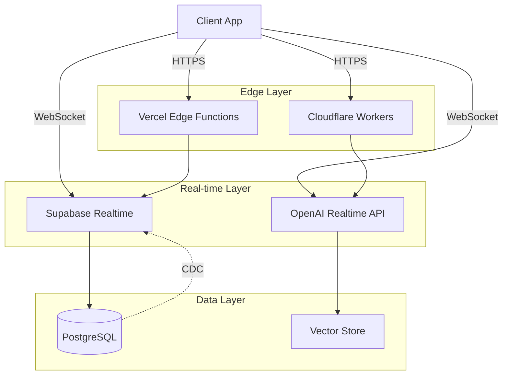

# Integration Architecture

This document outlines the key architectural patterns for integrating OpenAI's Realtime API with Supabase Realtime in web applications.

## Overview

The integration combines two powerful real-time systems:
- **OpenAI Realtime API**: Low-latency, multi-modal conversational AI
- **Supabase Realtime**: Real-time database synchronization and broadcasting

## Key Integration Patterns

### 1. Real-time Voice + Database Sync

This pattern enables voice conversations to trigger database updates in real-time.

```typescript
// OpenAI Realtime connection
const openaiWs = new WebSocket('wss://api.openai.com/v1/realtime');

// Supabase Realtime subscription
const channel = supabase
  .channel('conversation-updates')
  .on('postgres_changes', { 
    event: '*', 
    schema: 'public', 
    table: 'conversations' 
  }, handleDatabaseChange)
  .subscribe();

// Sync voice events to database
openaiWs.on('conversation.item.created', async (event) => {
  await supabase.from('conversations').insert({
    content: event.item.content,
    role: event.item.role,
    timestamp: new Date()
  });
});
```

### 2. Multi-Agent Systems

Sequential agent handoffs with state persistence:

```typescript
interface Agent {
  id: string;
  capabilities: string[];
  handoffConditions: (context: Context) => boolean;
}

class AgentOrchestrator {
  async handoff(fromAgent: Agent, toAgent: Agent, context: Context) {
    // Persist handoff in Supabase
    await supabase.from('agent_handoffs').insert({
      from_agent: fromAgent.id,
      to_agent: toAgent.id,
      context: context,
      timestamp: new Date()
    });
    
    // Update OpenAI conversation context
    await openaiClient.updateContext({
      agent: toAgent.id,
      previousContext: context
    });
  }
}
```

### 3. Authorization & Security

Implementing Row Level Security (RLS) with realtime channels:

```sql
-- Supabase RLS policy
CREATE POLICY "Users can only see their conversations"
ON conversations
FOR SELECT
USING (auth.uid() = user_id);

-- Private channel authorization
CREATE FUNCTION authorize_channel(channel_name text)
RETURNS boolean AS $$
BEGIN
  -- Custom authorization logic
  RETURN EXISTS (
    SELECT 1 FROM channel_members 
    WHERE user_id = auth.uid() 
    AND channel = channel_name
  );
END;
$$ LANGUAGE plpgsql SECURITY DEFINER;
```

### 4. Scalable Architecture



## Implementation Considerations

### Connection Management

1. **Reconnection Logic**: Both services require robust reconnection handling
2. **Connection Pooling**: Manage WebSocket connections efficiently
3. **Heartbeat Management**: Keep connections alive with periodic pings

### State Synchronization

1. **Optimistic Updates**: Update UI before confirmation
2. **Conflict Resolution**: Handle concurrent updates gracefully
3. **Event Ordering**: Ensure proper sequencing of events

### Performance Optimization

1. **Edge Deployment**: Use edge functions for reduced latency
2. **Connection Reuse**: Share WebSocket connections where possible
3. **Batch Operations**: Group database operations for efficiency

## Best Practices

1. **Error Boundaries**: Implement comprehensive error handling
2. **Graceful Degradation**: Fallback mechanisms for service outages
3. **Monitoring**: Track latency and error rates
4. **Rate Limiting**: Implement client-side rate limiting

## Example Architecture

A typical production architecture might include:

- **Frontend**: Next.js with React
- **Real-time Voice**: OpenAI Realtime API
- **Real-time Data**: Supabase Realtime
- **Database**: PostgreSQL (via Supabase)
- **Authentication**: Supabase Auth
- **Edge Functions**: Vercel Edge or Cloudflare Workers
- **Vector Search**: pgvector or dedicated vector database

## Next Steps

- Review the [Tech Stack](./tech-stack.md) guide
- Explore [Security Best Practices](./security-best-practices.md)
- See practical [Use Cases](./use-cases.md) 